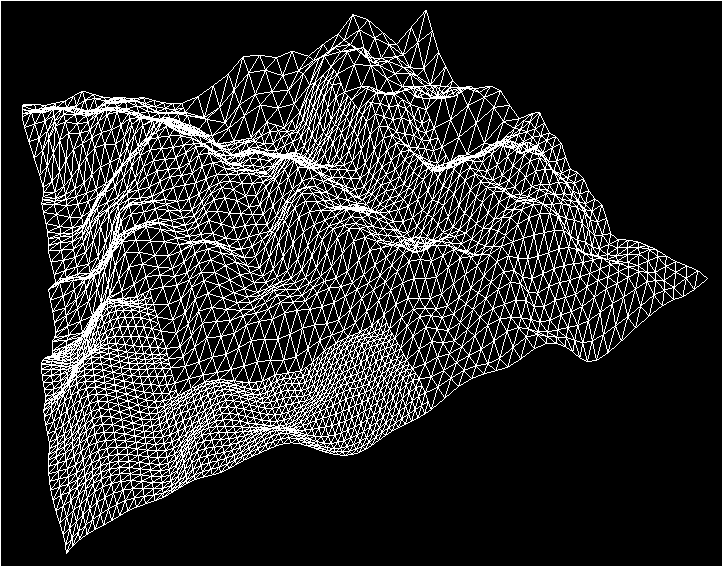

### naive-seamless-terrain for Godot(4.*)

 - This is a slow, GDScript based Terrain system with "seamless" LOD borders.
 - The method used to avoid seams is pretty naive, it doesn't attempt to blend mesh shapes or match topology, it simply ensures edge vertices that do not align with a neighbouring Patches own vertices(of a different subdivision) are linearly interpolated so that it sits flush with that neighbours edge elevation.
 - Add a lod_patch.gd script to MeshInstance3D Nodes that are spaced 1x1 unit apart.
 - Call `do_lod` with a Vector3 argument to generate a LOD for the distance to that Vector3.
 - Tweak `max_detail` in `lod_patch.gd` to control max subdivision.
 - Set `elevation_function` to your own `Callable` that accepts `x` and `z` as arguments and returns a `float` value representing elevation.
 - Don't use this.
 
 
